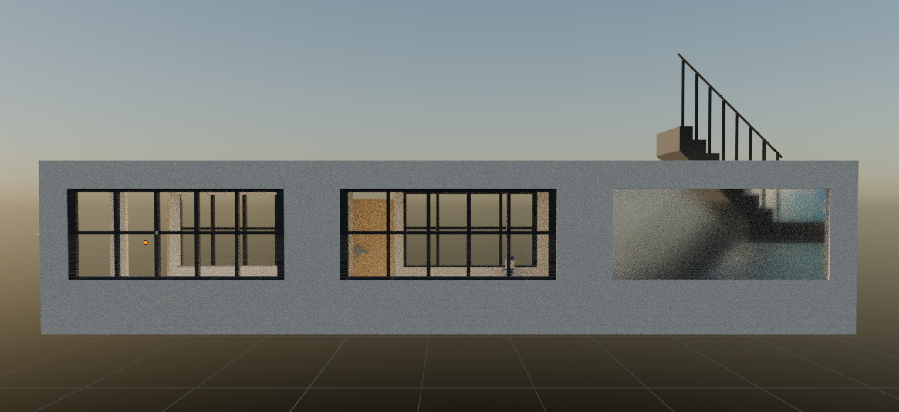

# Tugas Grafkom WebGL
## Rakha Fathin Izzan Consetta (5025221156)

### Objek Asli 
Berikut adalah foto untuk referensi model 3D yang akan dibuat dengan menggunakan software Blender

### Hasil WebGL
Berikut adalah hasil dari menggambar 3D Object pada WebGL menggunakan file .obj dan .mtl yang telah diexport dari Blender

### Hasil Dalam Blender
Berikut adaah gambaran objek dalam Blender

